# Section 7 – Experiments

All runs: `writeup/experiment_log.md` (one row per run, config / tokens / steps /
wall-clock / final losses); curves: `writeup/figures/*.png` (every figure exists in a
`_steps` and a `_wallclock` version).  Code: `cs336_basics/train.py` (training loop +
jsonl logging, §5), `scripts/plot_runs.py` (curves + summary table from the jsonl logs),
`scripts/eval_checkpoint.py` (loss over the *entire* validation set),
`scripts/sec7_make_figures.sh` (the exact plot commands for every figure below),
`scripts/generate.py` (§6 decoding).  Run directories with logs / configs / checkpoints
are kept outside the repository (`/home/c12/workspace/claude_workspace/cs336_a1/sec7-exp/runs/`).

## Setup and compute accounting

* Hardware: one RTX 5080 (16 GB, shared; our jobs were capped at ≈6 GB and one training
  process at a time), 4 CPU cores, `bf16` autocast + TF32 + `torch.compile`
  (Inductor).  Not a B200, so the assignment's "B200-hours" do not apply; we report
  wall-clock on this card everywhere.  Baseline throughput for the 17M-parameter model
  (22.7M with embeddings): **≈330–350k tokens/s at B=32** (bf16+compile; 140k without
  compile, 95k in fp32), i.e. the official 327.68M-token budget takes ≈17 min, the
  low-resource 40.96M-token budget ≈2.5 min.
* Baseline configuration (§7.2.1): vocab 10,000 (`out/ts10k`), context 256, d_model 512,
  d_ff 1344, 4 layers, 16 heads, RoPE Θ=10⁴, AdamW β=(0.9, 0.95), ε=1e-8, weight decay
  0.1, gradient clipping at global norm 1.0, linear warmup for 5% of the steps then cosine
  decay to α_min = α_max/10 ending exactly at the last step, batch 32.
* Two token budgets: **full** = 327,680,000 tokens (40,000 steps at B=32) for the
  final TinyStories model, and **short** = 40,960,000 tokens (5,000 steps at B=32,
  the assignment's low-resource budget) for every sweep/ablation.  Time was not the
  binding constraint (the whole section used ≈4 GPU-hours), the short budget was chosen
  so that sweeps stay comparable with the assignment's reference numbers (1.80 val loss
  at 5,000 steps).
* Validation loss during training is measured every 250 steps (short) / 1,000 steps
  (full) on the same 40 fixed random validation batches (327,680 tokens, seed 1234) for
  every run, so all curves are on identical data.  Final numbers for the headline models
  are recomputed on the **entire** validation set (5,465,856 tokens in non-overlapping
  256-token windows) with `scripts/eval_checkpoint.py`; the fixed-batch estimate is
  ≈0.01 optimistic (e.g. 1.6485 vs 1.6597 for the lr=3e-3 short run).
* Data: `data/ts_train_10k.npy` (541,229,347 tokens), `data/ts_valid_10k.npy`
  (5,465,883), `data/owt_train_32k.npy` (2.73B tokens, vocab `out/owt32k`),
  `data/owt_valid_32k.npy` (66.4M) — uint16 memmaps produced by
  `scripts/tokenizer_experiments.py encode` (§2.7).

### A bug found on the way (torch.compile + bf16 on the RTX 5080)

The very first compiled bf16 run produced NaN from step 1, while eager bf16, compiled
fp32 and eager fp32 were all fine.  Bisection (`dbg_nan*.py`, kept in the run
workspace) showed the forward is finite but Inductor's fused *backward* of
`einsum(Q,K)/sqrt(d_k) → softmax` in bf16 returns non-finite gradients for Q and K,
with or without the causal mask.  Computing the attention softmax in fp32
(`scores.float()`, `probs.to(V.dtype)`) — which is what autocast does for `softmax`
anyway — fixes it and costs nothing measurable.  The fix is now in `model.py` (`scaled_dot_product_attention`); the runs below were
launched through a thin wrapper that applied the identical patch before it was
merged, so all of them use exactly the current model code.

## experiment_log

Deliverable: `writeup/experiment_log.md` + `writeup/figures/`.  The infrastructure is
the jsonl logger in `cs336_basics/train.py` (every 20 steps: `step, train_loss, lr,
elapsed_s, tokens_seen, tokens_per_s, step_ms, grad_norm`; every eval: `val_loss,
val_perplexity`; `elapsed_s` survives `--resume`, so wall-clock curves are continuous),
`config.json` per run (all arguments + parameter count), and `scripts/plot_runs.py`,
which draws any set of runs against gradient steps *and* wall-clock time and prints the
markdown summary table used in the log (matplotlib is not a project dependency; run it
with any interpreter that has it).  Each run's raw logs are kept under
`runs/<group>/<name>/{log.jsonl,config.json,stdout.log,ckpt_final.pt}` (workspace, not
in git; checkpoints are 270 MB each).  `--wandb` mirrors the same records to W&B but
was not used here (no network dependency).

## learning_rate

**Search strategy.**  Coarse-to-fine grid at the short budget (5,000 steps, B=32),
warmup 250, cosine to α/10: first a ×3 grid 1e-4 … 1e-2, then the neighbours of the
minimum (2e-3, 5e-3), then ×3 steps upward until divergence (3e-2, 1e-1).  One seed
each; the differences between adjacent LRs near the optimum (0.01 nats) are at the
noise floor, so "best" means "best-or-tied".  Figures:
`figures/lr_sweep_{steps,wallclock}.png`, `figures/lr_divergence_{steps,wallclock}.png`.

<div class="fig-pair">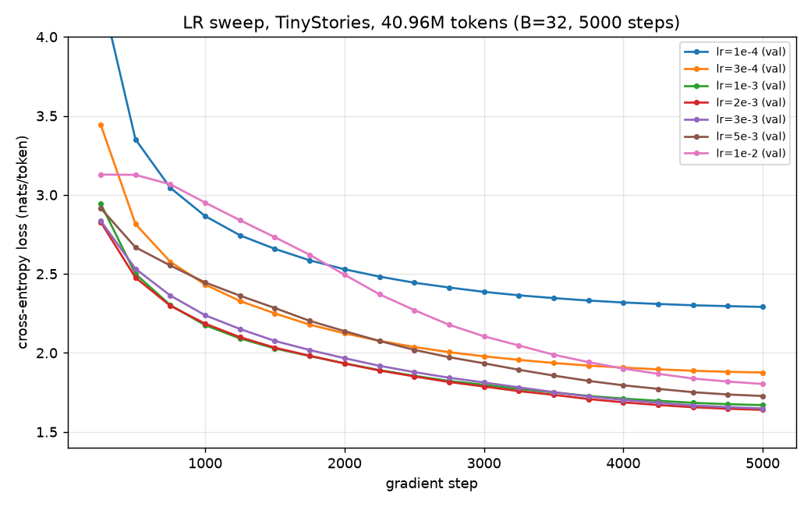 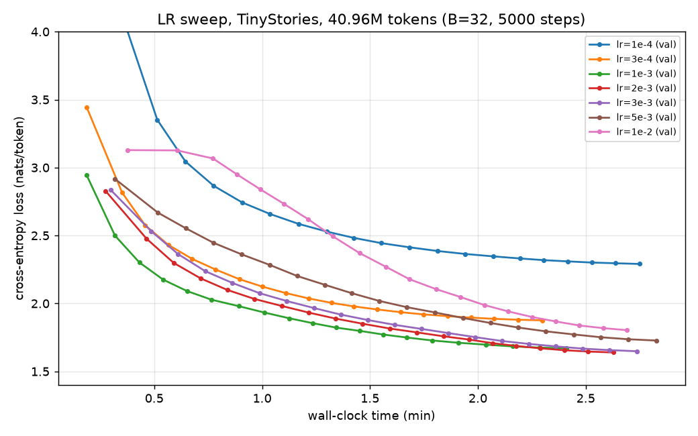</div>

<div class="fig-pair">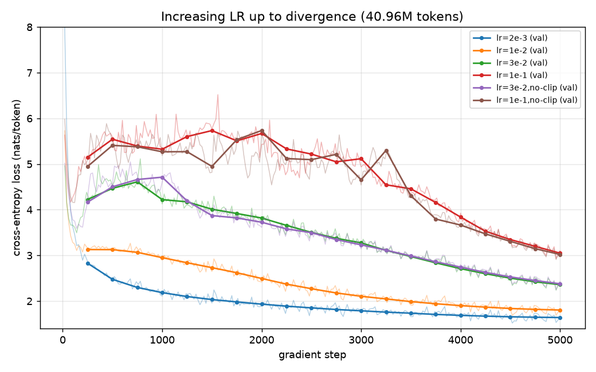 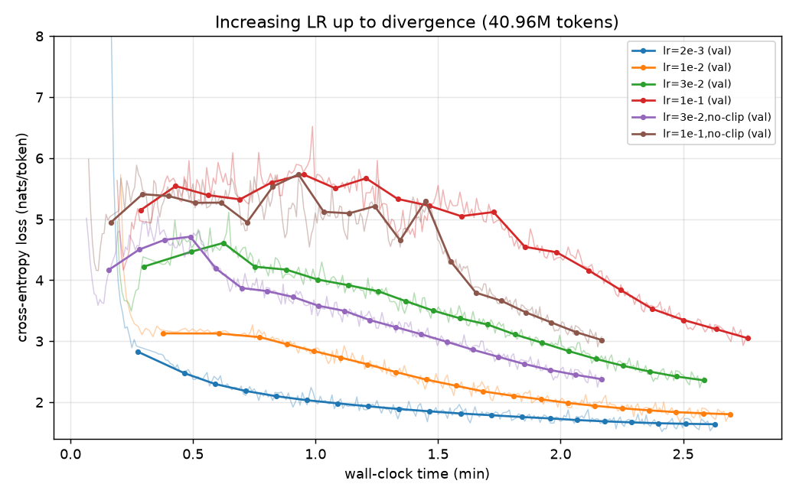</div>

| peak LR | 1e-4 | 3e-4 | 1e-3 | **2e-3** | 3e-3 | 5e-3 | 1e-2 | 3e-2 | 1e-1 |
|---|---|---|---|---|---|---|---|---|---|
| val loss @5,000 steps (40.96M tokens) | 2.291 | 1.876 | 1.669 | **1.639** | 1.648 | 1.727 | 1.803 | 2.359 | 3.049 |

The optimum is broad (2e-3 – 3e-3, ×10 above the "safe" 3e-4 many people start with);
at 1e-3 the model is still clearly under-trained at 5,000 steps, at 5e-3 and above the
early phase gets worse (higher loss during/after warmup, more noise) and the run never
catches up within the budget.

**(a) Full-budget model.**  `ts_full_lr3e-3` (and `ts_full_lr2e-3`): baseline
architecture, 327,680,000 tokens = 40,000 steps × 32 × 256, warmup 2,000, cosine to
α/10 at step 40,000.  Figure `figures/ts_full_{steps,wallclock}.png`.

<div class="fig-pair">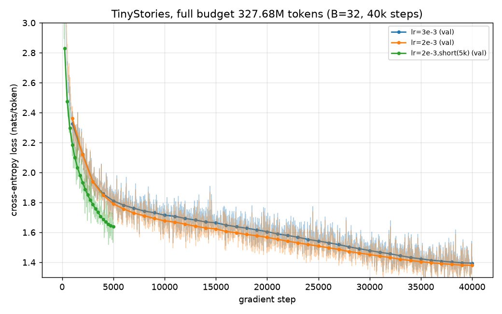 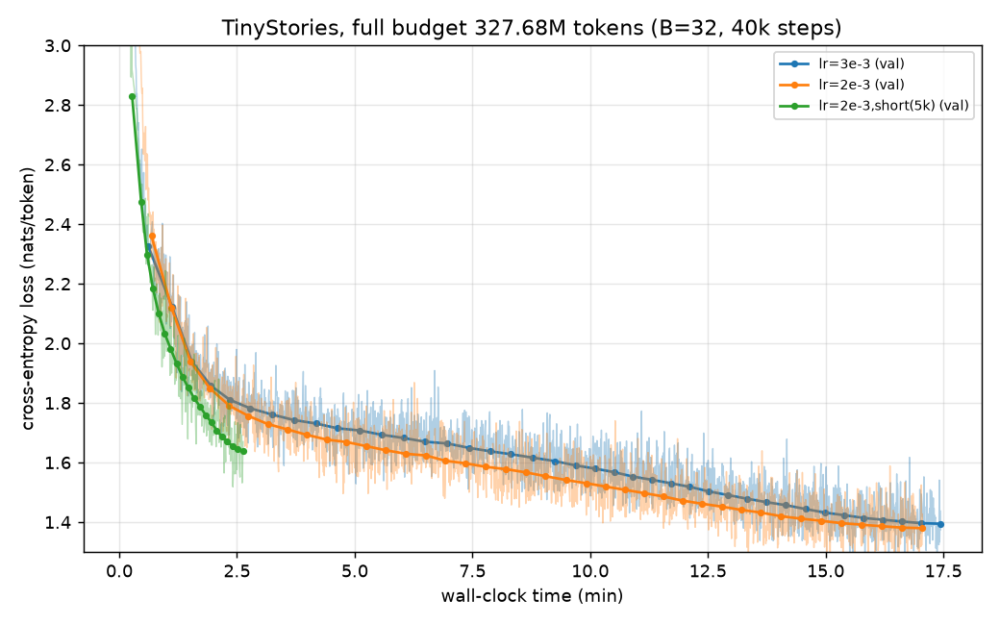</div>

| run | LR (peak → min) | wall-clock | tokens/s | val loss, 40 fixed batches (last / best) | **val loss, full validation set** |
|---|---|---|---|---|---|
| `ts_full_lr3e-3` | 3e-3 → 3e-4 | 17.4 min | ≈305–340k | 1.3945 / 1.3945 | 1.4066 (ppl 4.08) |
| `ts_full_lr2e-3` | 2e-3 → 2e-4 | 17.1 min | ≈305–345k | 1.3796 / 1.3796 | **1.3909 (ppl 4.02)** |

Both meet the ≤1.45 target; `ts_full_lr2e-3/ckpt_final.pt` (1.391) is the model used
for `generate` below.  The two full runs confirm the sweep's ranking (2e-3 ≥ 3e-3),
and a second seed at the short budget agrees within noise (2e-3: 1.639 / 1.628;
3e-3: 1.648 / 1.634 for seeds 0 / 1).  On the wall-clock axis the full run reaches
the short run's final loss (1.64) after ≈4 min and keeps improving almost linearly in
log-time to 1.39 at 17 min; the schedule (cosine to α/10 ending at the last step)
gives the characteristic final drop of ≈0.05 in the last 15% of the run.

**(b) Edge of stability.**  With gradient clipping (norm 1.0) *no* learning rate produced
NaN: 3e-2 and 1e-1 "diverge" in the sense that the loss, after falling to ≈3.5–4.2 in
the first 100 steps, turns around and climbs to 4.6 (3e-2) / 5.7 (1e-1) as the warmup
pushes the LR past ≈1.5e-2, stays there for thousands of steps, and only recovers
partially once cosine decay brings the LR back below ≈1e-2 (final 2.36 / 3.05).  In
both runs the turning point is at LR ≈ 1.2e-2–3e-2 (step ≈100 of the 250-step warmup
for 3e-2, step ≈80 for 1e-1), which is also where the un-clipped runs blow up:
without gradient clipping (`--grad-clip 0`) the picture is the same — 3e-2 ends
at 2.379 (vs 2.359 clipped) and 1e-1 at 3.020 (vs 3.049) — because AdamW's
per-coordinate normalisation already bounds the update size, so "divergence" for
this optimizer does not look like NaN but like a loss that shoots up towards the
unigram entropy (≈4.5–5.7 nats) and stays there while the LR is high.  (The one
configuration that did produce NaN is the no-RMSNorm model at 3e-3, see the ablation
below.)
So the instability threshold of this model/optimizer is ≈1e-2 – 3e-2, and the best
learning rate (2e-3 – 3e-3) sits ≈5–10× below it — consistent with the folk wisdom
that one should train close to, but not at, the edge of stability: 1e-2 (≈threshold/2)
still trains but is *worse* than 3e-3 at every step of the curve, and 3e-4 (threshold/50)
is far too slow.  Convergence speed grows with LR up to ≈threshold/5 and then degrades
because the noise floor (loss oscillation ∝ LR) and warmup damage dominate before the
higher LR can pay off.

## generate

Best checkpoint: `ts_full_lr2e-3/ckpt_final.pt` (full-validation loss 1.391).  Command:
`scripts/generate.py --checkpoint … --vocab out/ts10k/vocab.json --merges out/ts10k/merges.txt
--prompt "Once upon a time" --max-new-tokens 300 --temperature 0.8 --top-p 0.9 --seed 7 --no-eos-stop`
(without `--no-eos-stop` every sample ends at `<|endoftext|>` after 140–200 tokens, because
TinyStories stories are short; the 300-token dump below therefore contains the end of one
story and the start of the next).

```
Once upon a time, there was a little boy named Tim. Tim loved to play outside. One day, he found a small rock. He was very happy. He thought it was a magic rock.
Tim showed the rock to his friend, Sam. Sam said, "Wow! That's a cool rock. Can I see it?" Tim and Sam said, "Yes, but be careful. The rock can be dangerous."
Tim and Sam played with the rock. They took turns to push it with their hands. They had so much fun. At the end of the day, Tim and Sam were tired. They said goodbye to the rock and went home. Tim was glad he had a fun day with his friend.
<|endoftext|>
One day, a little boy named Tim went to the park with his mom. Tim saw a big, orange ball near a tree. He wanted to play with the ball, but it was too high. Tim was sad.
A nice girl named Sue saw Tim and asked, "Why are you sad?" Tim said, "I want to play with the orange ball, but it is too high." Sue thought for a moment and said, "I have an idea! Let's play together."
Sue and Tim played with the orange ball. They threw it back and forth. They had lots of fun. But then, something unexpected happened. The ball started to grow bigger and bigger!
"Wow, it's so big now!" said Tim. "Let
```

Same checkpoint, `--temperature 0.8 --top-p 0.9 --seed 1` (stopped at `<|endoftext|>`, 170 tokens):

```
Once upon a time, in a small house, there lived a little girl named Mia. Mia loved to play with her toys and run around the house. One day, she found a magic word in the house. The word was " math." She did not know what it meant, but she wanted to learn.
Mia decided to learn math from the magic word. She went to her mom and showed her the magic word. Her mom said, "This is math. It helps us learn." Mia was very happy to learn this new word. She wanted to learn more.
Mia's mom showed her the magic word. She said, "Bally, now you can learn math too!" Mia was so excited. She loved learning new things and learning with her mom. From that day on, Mia always tried to learn math and it was always fun.
```

**Fluency.**  Grammatical, on-topic children's-story English with consistent character
names, dialogue punctuation and a moral-style ending, i.e. at least as good as the
assignment's reference sample; the residual errors are semantic (a "magic word … math",
"Mr. Bear was very rough and could not talk" followed by Mr. Bear talking) rather than
syntactic — the 17M model has learned the surface form and the local plot template of
TinyStories but not reliable world/state tracking over a whole story.

**Factors that change the quality (all observed with this checkpoint / its siblings):**

1. *Temperature / top-p.*  `T=1.0, top-p=1.0` (pure sampling) produces stories that
   drift into nonsense ("there was a cone. This cone was called candy … the cone still could
   not decorate her") because low-probability tokens are drawn; `T=0.3` or greedy
   (`T=0`) is perfectly fluent but collapses onto the same template every time ("there was
   a little girl/boy named Lily/Tim … loved to play with … One day …"), and greedy tends
   to repeat phrases.  `T≈0.7–0.9` with `top-p 0.9` is the sweet spot: nucleus sampling
   removes the tail that causes the semantic derailments while keeping variety.
2. *Training tokens / validation loss.*  The 40.96M-token checkpoint of the same
   architecture (`lr_sweep/lr2e-3`, val 1.64) with the same decoder settings and seed
   yields the same kind of story but with more non-sequiturs per sentence ("The mouse said,
   'Please open the box, and you will open it.'"); the 3e-4 short run (val 1.88) is worse
   again ("The mouse was happy and said, 'Hello, I am Tim.'").  Loss differences of
   0.2–0.5 nats are clearly visible in the samples.
3. *Model size / dataset* (see main_experiment below): the identical model trained on
   OpenWebText with the same budget reaches loss ≈4.16 and its samples are far less coherent — with
   a much broader domain, 17M parameters and 327M tokens are simply not enough.
4. *Prompt.*  The model has only ever seen stories, and "Once upon a time" is the
   canonical opening; unusual prompts push it off-distribution quickly.

## layer_norm_ablation

`--no-rmsnorm` removes the two block norms and the final norm (`norm="none"`).
Figure `figures/ablation_rmsnorm_{steps,wallclock}.png`.

<div class="fig-pair">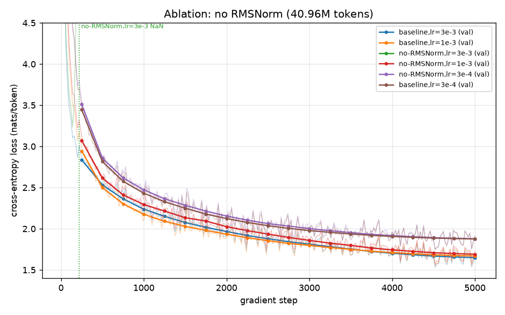 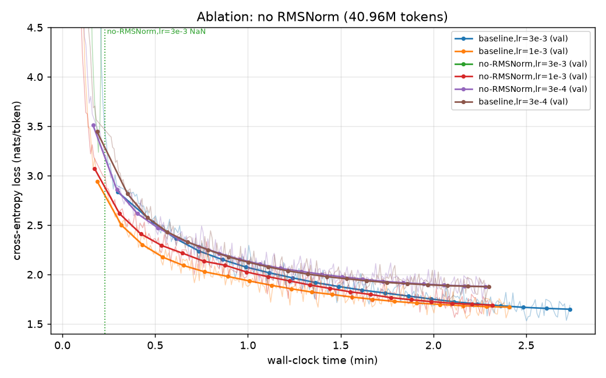</div>

| run | LR | outcome | val loss @5k |
|---|---|---|---|
| baseline | 3e-3 | fine | 1.648 |
| no RMSNorm | 3e-3 (previous optimum) | **diverges**: loss falls to 3.2 by step 140, grad-norm spikes to 32 at step 160 (LR ≈1.9e-3 during warmup), loss 4·10⁴ at step 200, NaN from step 220 | NaN |
| no RMSNorm | 1e-3 | trains; noisier grads (final grad-norm 0.9 vs 0.3–0.4) | 1.690 |
| no RMSNorm | 3e-4 | trains, but slow | 1.879 |
| baseline | 1e-3 / 3e-4 | | 1.669 / 1.876 |

Comment: without normalisation the residual stream's scale is unconstrained, so the
effective step size of Adam's per-parameter normalised update grows with the
activations, and the model becomes unstable at ≈1/2 the LR that the pre-norm model
tolerates comfortably.  A 3× lower LR restores stability, and then the loss is only
0.02–0.04 worse than the baseline at the same LR — i.e. at this depth (4 layers)
RMSNorm buys mostly *stability / a wider usable LR range*, not a better optimum, and
its cost is a smaller maximum learning rate for the un-normalised model, which is
exactly what makes it worse at a fixed step budget (1.690 vs the baseline's 1.639–1.648
at its own best LR).

## pre_norm_ablation

`--post-norm`: z = RMSNorm(x + Attn(x)), y = RMSNorm(z + FFN(z)), no final norm.
Figure `figures/ablation_postnorm_{steps,wallclock}.png`.  At the same LR (3e-3) the
post-norm model trains stably (no NaN, no spikes) but is worse from the first
evaluation on and ends at **1.701 vs 1.648** (pre-norm), i.e. the gap does not close
with training.  Post-norm re-normalises the residual stream after every block, so the
identity path from the embedding to the output is broken (each block's output is
scaled by the norm), gradients to early layers are attenuated and the model behaves
more like a deep non-residual network — slower optimisation and a lower tolerance to
large learning rates (with only 4 layers we see the slower optimisation but not the
instability; the classic result is that post-norm needs warmup and small LRs at depth).
Pre-norm keeps a clean residual path, which is why it is the consensus choice.

<div class="fig-pair">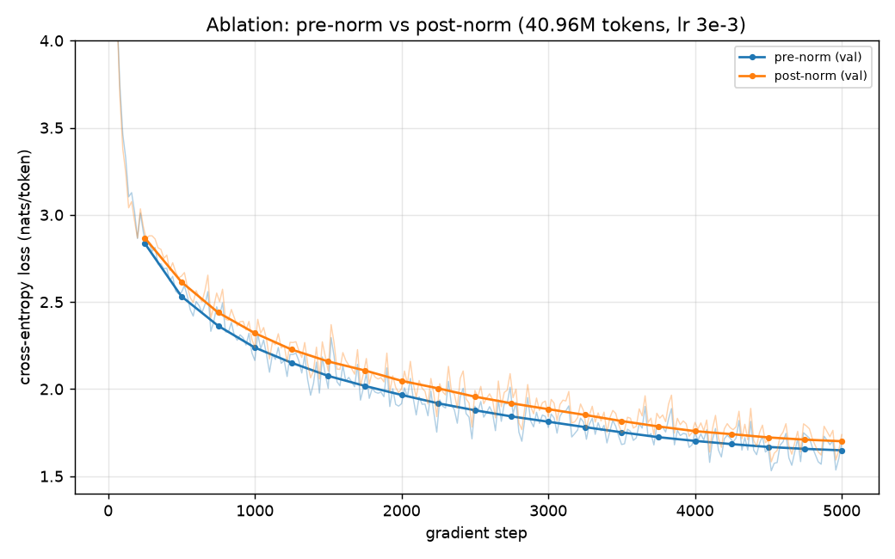 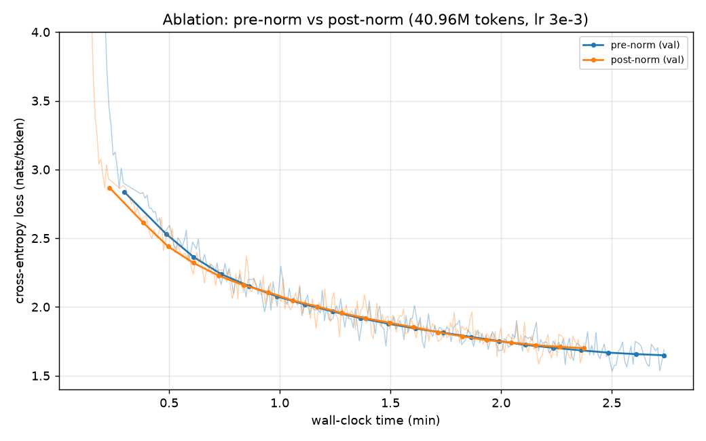</div>

## no_pos_emb

`--no-rope` (NoPE: no positional information at all; the causal mask is the only
position signal).  Figure `figures/ablation_nope_{steps,wallclock}.png`.  NoPE trains
stably but is worse throughout: **1.798 vs 1.648** at 5k steps (Δ = 0.15 nats, i.e. more
than the gap between the best LR and a 3× too small LR).  A causal decoder can in
principle recover position (e.g. by counting via attention to a BOS-like token), but
it has to *learn* that representation, spending capacity and steps on it, and the
learned signal is less precise than RoPE's explicit relative rotation — a large
handicap for a task where local order (subject–verb–object, quotes) matters and the
model is small and trained briefly.  With a longer budget the gap would shrink but not
vanish (RoPE's inductive bias is simply the right one for language).

<div class="fig-pair">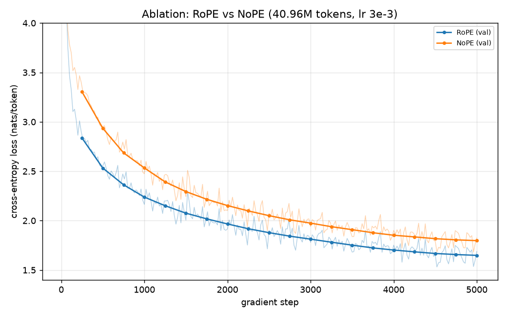 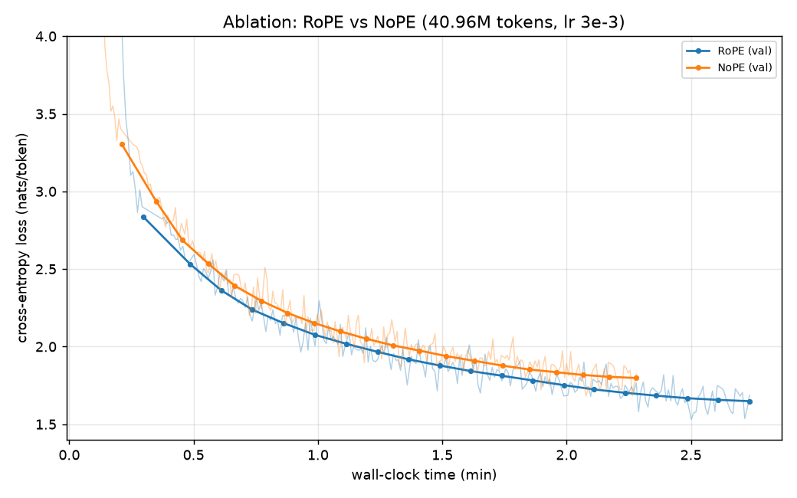</div>

## swiglu_ablation

`--ffn silu --d-ff 2048` (FFN(x) = W₂ SiLU(W₁x) with d_ff = 4·d_model, 2 matrices) vs the
SwiGLU baseline (d_ff 1344, 3 matrices).  Parameter counts: 22.83M vs 22.70M (FFN 2.10M vs
2.06M per layer) — matched within 0.6%.  Figure `figures/ablation_swiglu_{steps,wallclock}.png`.

<div class="fig-pair">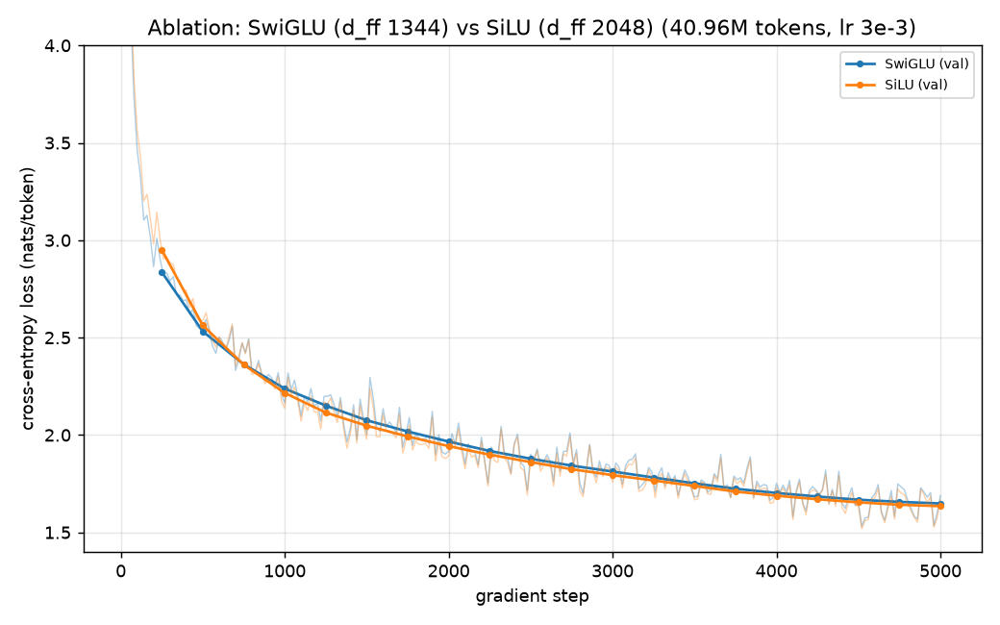 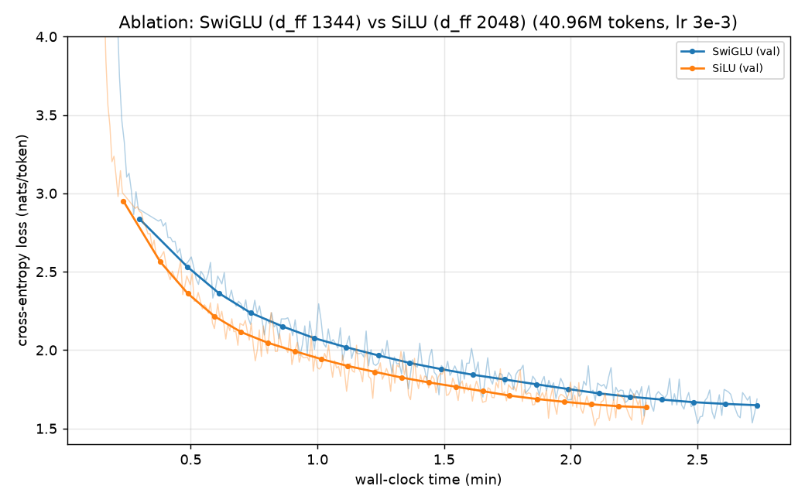</div>

| FFN | params | seed 0 | seed 1 | mean |
|---|---|---|---|---|
| SwiGLU, d_ff 1344 (baseline) | 22.70M | 1.648 | 1.634 | 1.641 |
| SiLU (no gate), d_ff 2048 | 22.83M | 1.635 | 1.646 | 1.640 |

(second seeds: `figures/ablation_swiglu_seeds_{steps,wallclock}.png`)

<div class="fig-pair">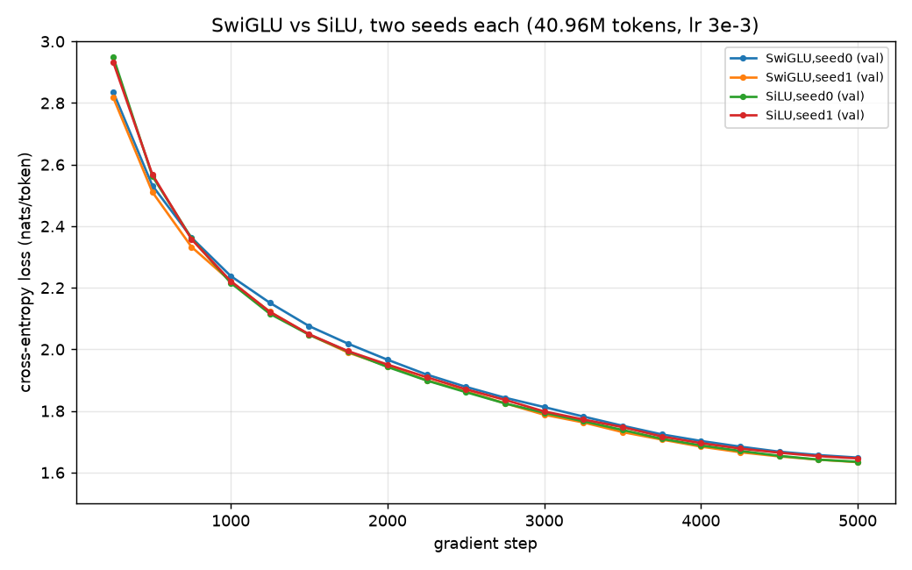 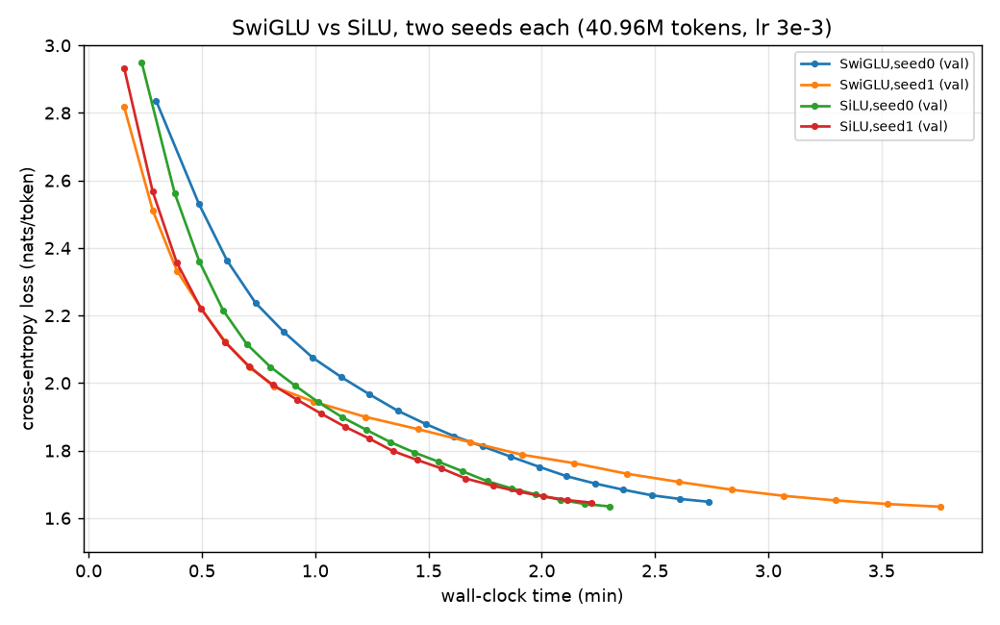</div>

At this scale and budget the two are **indistinguishable**: the seed-to-seed spread
(0.014) is as large as the difference between the architectures, and the curves lie on
top of each other for the whole run.  Throughput is also the same (both ≈330–340k
tok/s: the gated FFN has 3 smaller matmuls, the plain one 2 larger ones, same FLOPs).
So we do not reproduce Shazeer's "GLU variants are better" here — his gains
(≈0.02–0.05 in log-perplexity for T5-base) were measured on much larger models and
far longer training; with a 4-layer 17M-parameter model trained for 40M tokens on
TinyStories the FFN is not the bottleneck (the loss is dominated by what the model
has seen, not by FFN expressivity), and the extra element-wise gate neither helps nor
hurts optimisation.  What the ablation *does* confirm is that SwiGLU's parameter
re-allocation (three matrices with d_ff = 8/3·d_model instead of two with 4·d_model)
is "free": you get the gating mechanism, which pays off at scale, at equal parameter
count, FLOPs and throughput.

## batch_size_experiment

Fixed budget of 40.96M tokens for every batch size (steps = 40.96M / (B·256)), warmup 5%
of the steps, cosine to α/10, LR re-tuned per batch size with two values each (the
B=32 optimum 3e-3 and a √B-scaled guess), validation on the same 327,680 tokens
(`--eval-batches 1280/B`).  Figure `figures/batch_size_{steps,wallclock}.png`
(step axis is log-scaled because the step counts span 2,500 … 160,000).

<div class="fig-pair">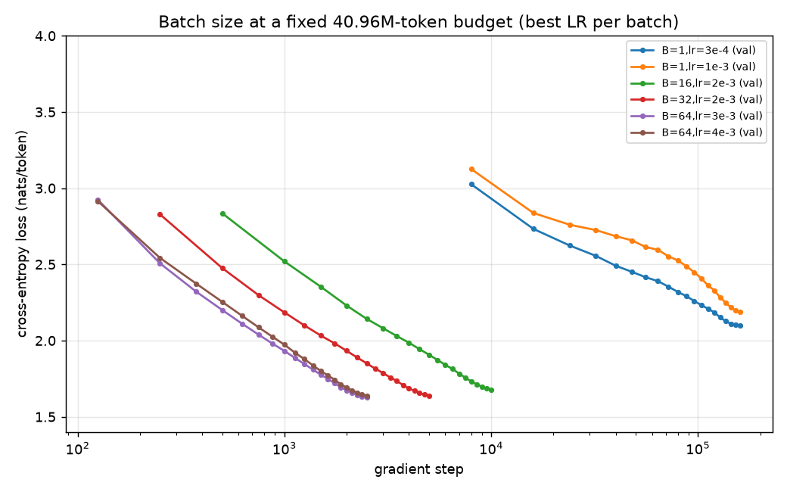 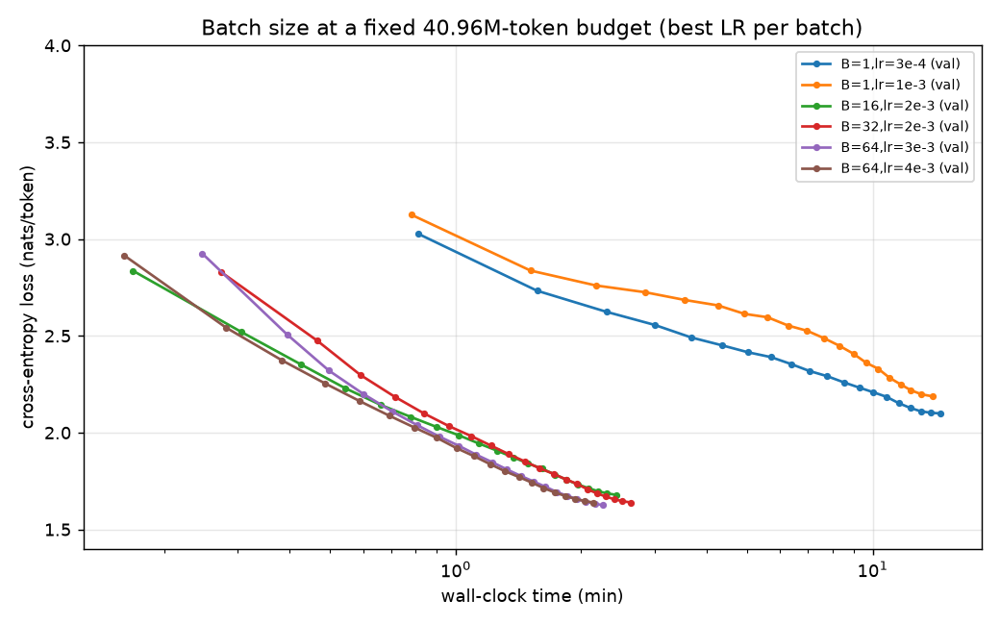</div>

| batch | steps | LR tried → best | val loss @40.96M tokens | wall-clock | tokens/s | peak VRAM |
|---|---|---|---|---|---|---|
| 1 | 160,000 | 1e-3 → 2.188, **3e-4 → 2.099** | 2.099 | 14.5 min | ≈47–52k | 0.47 GiB |
| 16 | 10,000 | 3e-3 → 1.695, **2e-3 → 1.679** | 1.679 | 2.4 min | ≈305k | 1.56 GiB |
| 32 | 5,000 | 3e-3 → 1.648, **2e-3 → 1.639** | 1.639 | 2.6 min | ≈290–335k | 2.72 GiB |
| 64 | 2,500 | 4e-3 → 1.639, **3e-3 → 1.625** | 1.625 | 2.3 min | ≈350k | 5.05 GiB |
| 128 / 256 | — | — | OOM under our ≈6 GB share (B=128 needs ≈10 GB) | — | — | — |

(The B=32 runs happened to overlap with a CPU-heavy tokenisation job on the shared box, hence their lower tokens/s; other B=32 runs reached 325–345k.)

**Memory limit.**  Peak allocated memory (bf16 autocast, compiled, AdamW): B=1 0.47 GiB,
16 1.56 GiB, 32 2.72 GiB, 64 5.05 GiB (≈6.5 GB as seen by `nvidia-smi` including the
CUDA context / compile workspace); B=128 ran out of memory at ≈8.5 GiB allocated (needs
≈10 GB, dominated by the fp32 logits and their softmax/CE intermediates:
128·256·10,000·4 B = 1.3 GB per copy) — above the ≈6 GB share we had on the 16 GB
card, so B=64 was the largest batch we could run and 128/256 were skipped.

**Findings.**  (i) *Throughput*: B=1 is 6–7× slower per token than B≥16 (≈50k vs
300–350k tok/s) because every kernel is launch/latency-bound and the matmuls are
tiny; from B=16 upward the GPU is already saturated by this small model
(305k → 335k → 350k tok/s for 16 → 32 → 64), so larger batches buy only ~10%
more throughput.  (ii) *Sample efficiency at a fixed token budget*: the loss after
40.96M tokens improves monotonically with batch size, but with strongly diminishing
returns: 2.10 (B=1) ≫ 1.68 (16) > 1.64 (32) > 1.625 (64).  B=1 is dramatically worse
even with a re-tuned (much smaller) LR: with Adam's per-coordinate normalisation the
gradient noise at B=1 is so large that a small LR is needed, and 160k tiny steps then
cover the same tokens with far less progress per token — the noise, not the number of
updates, is what limits it.  Between 16 and 64 we are below the *critical batch size*
for this model/dataset (the regime where doubling B halves the number of steps at
almost no loss penalty), so larger batches are pure win: same tokens, fewer and
cheaper steps, slightly better loss.  (iii) *Learning rate*: the best LR grows with
batch size (3e-4 → 2e-3 → 2e-3 → 3e-3), roughly like √B as expected for Adam, so the
LR must be re-tuned when the batch changes.  (iv) *So do we always want large
batches?*  Not unconditionally: past the critical batch size more sequences per step
would stop reducing the number of steps needed (the loss-vs-tokens curve would get
*worse*), and at this model size we already gain little throughput beyond B=32; the
practical limit here was memory (fp32 logits of B×256×10,000), and for a fixed
*wall-clock* budget B=32–64 is the sweet spot on this GPU.  Larger batches also
mean fewer optimizer steps for the same data, which is exactly the regime where the
LR schedule / warmup starts to matter more.

## main_experiment (OpenWebText)

Same architecture (vocab 32,000, `out/owt32k`; everything else identical), same
step counts as the TinyStories runs: 5,000 steps × B32 (40.96M tokens) at two learning
rates, then the full 40,000 steps (327.68M tokens) at the better one.  Figure
`figures/owt_{steps,wallclock}.png` (TinyStories runs of the same budget overlaid).

<div class="fig-pair">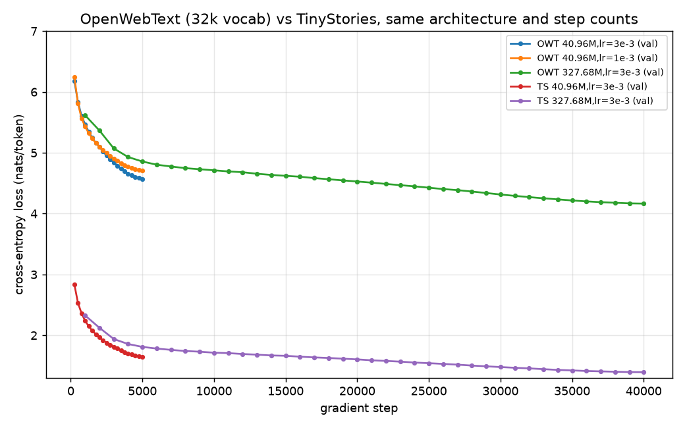 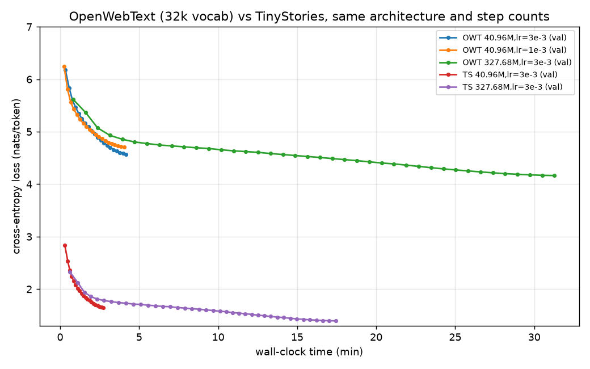</div>

| run | data | LR | steps × B | tokens | wall-clock | tokens/s | val loss (fixed batches) | full-val-set loss |
|---|---|---|---|---|---|---|---|---|
| `owt40M_lr3e-3` | OWT | 3e-3 | 5,000 × 32 | 40.96M | 4.2 min | 181k | 4.572 | — |
| `owt40M_lr1e-3` | OWT | 1e-3 | 5,000 × 32 | 40.96M | 4.1 min | 181k | 4.708 | — |
| `owt_full_lr3e-3` | OWT | 3e-3 | 40,000 × 32 | 327.68M | 31.3 min | 178k | **4.165** | **4.157** (ppl 63.9; first 25.6M val tokens) |
| `lr3e-3` (TS) | TinyStories | 3e-3 | 5,000 × 32 | 40.96M | 2.7 min | ≈330k | 1.648 | 1.660 |
| `ts_full_lr3e-3` (TS) | TinyStories | 3e-3 | 40,000 × 32 | 327.68M | 17.4 min | ≈330k | 1.395 | 1.407 |

The OWT model has 45.2M parameters (the 32k vocabulary adds 2×16.4M embedding / LM-head
weights to the same 17M-parameter body) and runs at ≈178k tok/s instead of ≈330k:
the vocabulary projection and the fp32 cross-entropy over 32,000 logits dominate the
step time of a model this small.  The same LR (3e-3) was best on both datasets.

**Interpreting the losses.**  The OWT loss is 4.16 vs 1.39 on TinyStories after the identical
number of steps and tokens, i.e. perplexity 64 vs 4.  Three things are mixed into
that number.  (1) *Different tokenizers ⇒ different units.*  A 32k-vocab token
carries more text than a 10k-vocab token (4.37 vs 4.12 bytes/token on these
corpora), so per-token losses are not directly comparable; per byte the numbers are
0.95 vs 0.34 nats/byte — still 2.8× apart, so most of the gap is real, not a unit
effect.  (2) *The data are intrinsically harder.*  TinyStories is synthetic
(GPT-3.5/4-generated) text with a ~1.5k-word vocabulary, a handful of plot templates
and near-perfect regularity, so a tiny model can approach its entropy; OWT is
open-domain web text — names, numbers, dates, URLs, code, dozens of registers — whose
irreducible entropy under any small model is far higher.  A loss of 4.16 nats/token
(≈0.95 nats/byte ≈ 1.37 bits/byte) is in fact a normal number for a ~50M-parameter
model at this budget; GPT-2-small-class models reach ≈3.0–3.3 nats/token on OWT with
100× more compute.  (3) *The model is severely under-trained for OWT.*  327M tokens
is 0.6 epochs of TinyStories but 0.12 epochs of our 2.7B-token OWT sample, and the
OWT curve is still descending steeply at the end (4.31 → 4.16 in the last 25% of
steps, with the fixed-batch loss dropping ≈0.15 per 10k steps) whereas the
TinyStories curve is flattening.  So the loss should be read as "how much of the web
can 17M non-embedding parameters absorb in 30 minutes" — much less than "how much of
TinyStories" — and it is only meaningful relative to other models on the *same*
tokenizer and validation set (which is exactly why the leaderboard fixes both).

**Generated text** (`owt_full` checkpoint, prompt "The", T=0.8, top-p 0.9, 256 tokens):

```
The Oklahoma City Commission is conducting a hearing on the case.

The document was obtained by phone from the AirBurna County Sheriff's Office. The internal review document was obtained by phone from the Star Tribune.

The document was released on October 13, 2015.

The document, which was released on October 16, said it was unable to provide details on what went into the package because the document was released and the document was originally leaked.

The document was compiled by a federal criminal complaint with the state Department of Education and Education.

The document includes the information obtained by the company's internal review.

The document states that the document was made using the documents with the purpose of the document and that it was defamatory.

The document reads, "Alberta said the document was a master and was personally found to have used a bomb in the 30s. He said the document was public and that it was never in the interest of the public."

The document states that the document was removed from the document, but that it was still not on release.

The document was sent by a state agency that reportedly says the document was collected and that it was intended to send out information on the document.
```

(A second sample with the TinyStories prompt "Once upon a time, …" turned into a
hospital anecdote: "the resident had been told that the first two patients would be
treated with each other …"; pure sampling `T=1, top-p=1` degrades into word salad —
"He mode said he needs to 'blame the stock action'".)

**Fluency.**  Locally the text is English: sentences are grammatical, the register
(wire-service news) is consistent, and there is even a plausible document structure
(dateline-like first sentence, quotes, "[3]"-style footnote markers under pure
sampling).  Globally it is nonsense: it loops on a few high-frequency frames ("The
document was …" ×10), entities and facts change every sentence, and there is no
discourse coherence beyond ~15 tokens.  It is clearly worse than the TinyStories
output even though model, tokens and compute are identical, because (i) OWT's
distribution is enormously wider — the model has to spread the same 17M
non-embedding parameters over news, forums, fiction, code and reference text and
never sees enough of any register to model it well (0.12 epochs, most bigrams
appear once), whereas TinyStories concentrates 327M tokens on a ~1.5k-word,
few-template domain that a 4-layer model can essentially memorise; (ii) the
useful context is much longer on OWT — a 256-token window rarely contains the
information needed to continue a news article coherently, while a whole TinyStory
fits in it; (iii) the loss gap itself: at 4.16 nats/token the model's next-token
distribution is still very flat (perplexity 64), so nucleus sampling has to draw from
many mediocre candidates at every step and errors compound quickly, whereas at 1.39
(perplexity 4) most tokens are near-deterministic and a story stays on track.
Also, OWT contains lots of boilerplate ("The document was released on …"), which a
weak model over-produces because it is the cheapest way to lower the loss.

## leaderboard

**Caveat first.**  The rules say 45 minutes *on a B200*; we have one RTX 5080 shared with
other jobs (≈6 GB VRAM, one process), whose bf16 throughput on this model is roughly
5–8× below a B200's, so our result is a "45 minutes of 5080 wall-clock" best effort and
is *not comparable* to the class leaderboard numbers (which see several times more
tokens in the same time).  What we can honestly report is the loss reached in 45 min on
this card and the reasoning behind the configuration.

**What we did.**  (1) The 40.96M-token OWT runs (`owt40M_lr3e-3/1e-3`) fixed the LR at
3e-3 (same optimum as on TinyStories).  (2) B=64 with the 32k vocabulary does not fit our
memory share (the fp32 logits alone are 2.1 GB per copy), so B=32.  (3) A small
"equal wall-clock" architecture probe: 4.5 minutes each with the cosine schedule sized
from a 100-step throughput measurement so it ends at 4 min (`figures/lb_probe_*`):

<div class="fig-pair">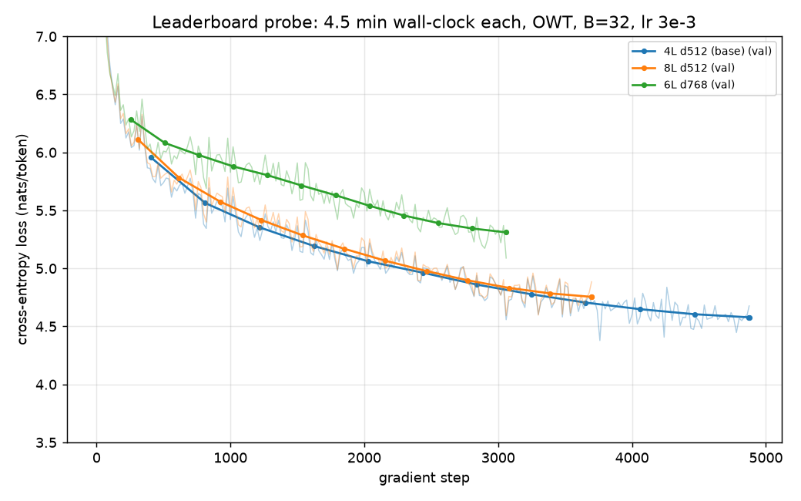 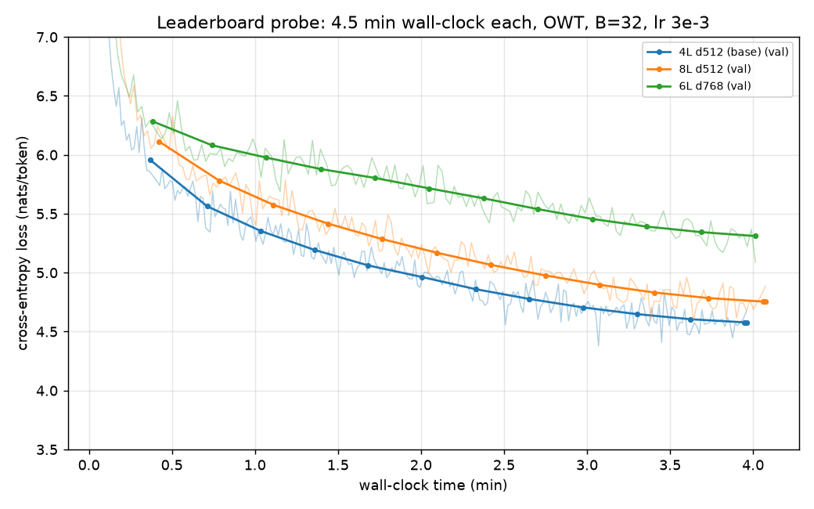</div>

| config | non-emb. params | tokens/s | steps in 4 min | val loss @4 min |
|---|---|---|---|---|
| **4 layers, d 512 (baseline)** | 12.5M | 178k | 4,875 | **4.579** |
| 8 layers, d 512 | 24.9M | 135k | 3,698 | 4.755 |
| 6 layers, d 768 (12 heads, d_ff 2048) | 42.5M | 111k | 3,060 | 5.311 |

At this (tiny) compute the smallest model wins clearly, so the leaderboard run keeps
the baseline architecture; the deeper/wider models are far from converged after a few
thousand steps and lose more from fewer steps than they gain from capacity (a 10×
longer run would narrow, and possibly flip, the ranking, but we could not afford to
test that at 45 min each).  Other candidate modifications (weight tying, QK-norm, a
Muon-style optimizer, longer context) were not implemented in the shared model /
optimizer code and were left out rather than tested untuned.  (4) Final run
`leaderboard/lb_L4_d512`: OWT, baseline architecture, B=32, ctx 256, AdamW
β=(0.9,0.95), wd 0.1, clip 1.0, peak LR 3e-3, warmup 4% (2,238 steps), cosine to 3e-4
ending at step 55,961 (chosen from the measured 177.7k tok/s so that the schedule
finishes at ≈43 min), `--max-wallclock-min 44.5` as a hard stop, eval every 1,000
steps on 40 fixed batches (327k tokens).

**Result.**  55,961 steps = 458.5M tokens in **43.1 min wall-clock** (compile + evals
included; stopped by `max_steps`, not by the time limit); validation loss **4.140** on
the fixed batches, **4.131** on the first 25.6M tokens of the OWT validation set;
curve `figures/leaderboard_{steps,wallclock}.png` (wall-clock axis ends at 43 min).  It
beats the naive 5.0 baseline by a wide margin and the 327.68M-token OWT run (4.165 /
4.157) by only ≈0.02, which is the honest picture at this scale: 40% more tokens
buys very little because the loss is decreasing roughly linearly in *log* tokens
(≈0.15 per doubling here) and the small model is the bottleneck.  On a B200 the same
recipe would see ≈2.5–3.5B tokens in 45 minutes (5–8× more) and would sit
around 3.7–3.9 by that extrapolation; getting substantially lower requires the model
changes above plus a larger model, which is what the top leaderboard entries do.

<div class="fig-pair">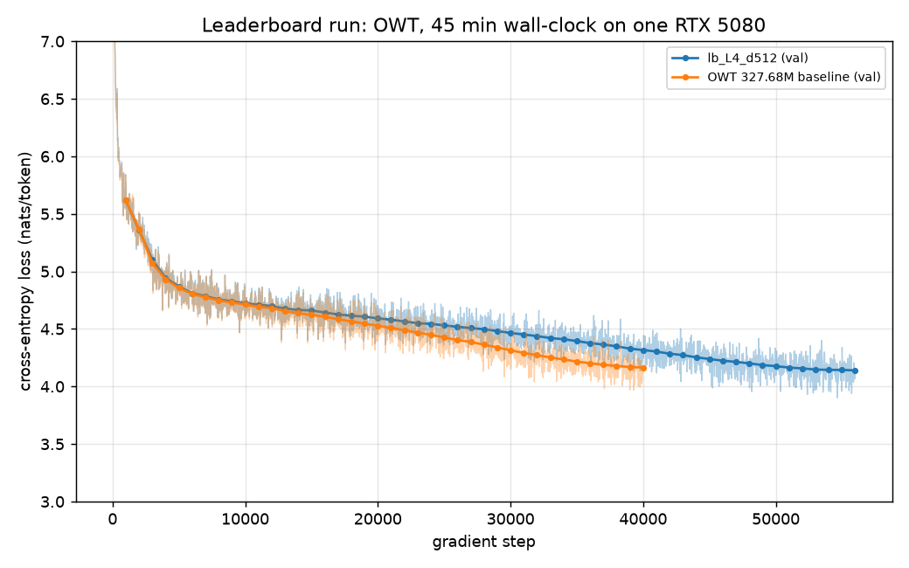 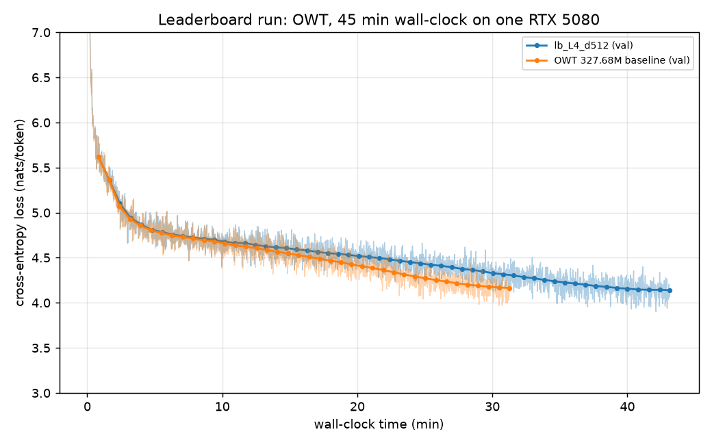</div>
